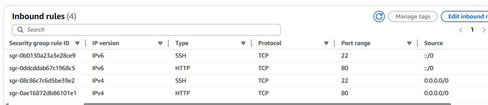

Sử dụng SSH để kết nối đến EC2 Instance và chạy các lệnh sau:

1.  **Cập nhật và Cài đặt Apache:**
    * Cập nhật các gói phần mềm và cài đặt Apache:
        ```bash
        sudo yum update -y
        sudo yum install -y httpd
        ```
    * Khởi động và bật dịch vụ Apache để nó tự động chạy khi khởi động lại:
        ```bash
        sudo systemctl start httpd
        sudo systemctl enable httpd
        ```

2.  **Cấu hình Apache và Kiểm tra IPv6:**
    * Dịch vụ Apache trên Amazon Linux mặc định đã được cấu hình để lắng nghe trên cả IPv4 và IPv6.
    * Kiểm tra trạng thái lắng nghe của dịch vụ:
        ```bash
        sudo netstat -tulpn | grep httpd
        ```
    * Kết quả sẽ hiển thị Apache lắng nghe trên các địa chỉ `0.0.0.0:80` (cho IPv4) và `:::80` (cho IPv6).
    

3.  **Cấu hình tường lửa (Security Group) cho IPv6:**
    * Truy cập **AWS EC2 console** > **Security Groups** và chọn `web-sg`.
    * Trong tab **Inbound rules**, thêm một quy tắc mới:
        * **Type**: HTTP
        * **Source**: Custom IPv6, nhập `::/0`
        * **Description**: `Allow HTTP from anywhere (IPv6)`
    * Lưu lại các thay đổi.
    
